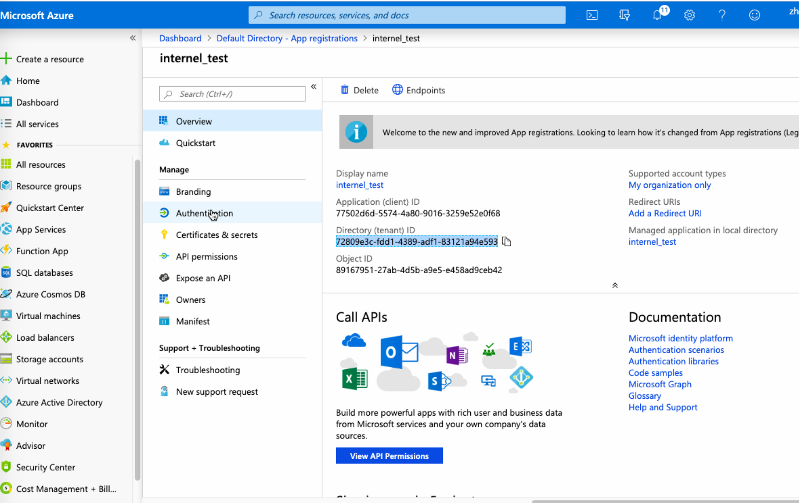
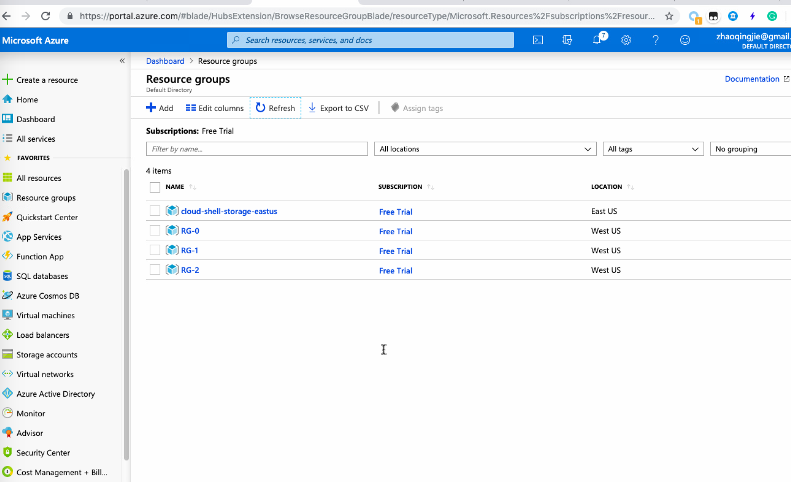

## check python version
```
CACSNYCMAC109:ds Operr$ python3 -V
Python 3.7.3
```
## install package
```
sudo pip3 install -r requirements.txt 
```

## set env
```
export AZURE_TENANT_ID=...
export AZURE_CLIENT_ID=...
export AZURE_SUBSCRIPTION_ID=...
export AZURE_CLIENT_SECRET=...
```


## create resource 3 groups
```
CACSNYCMAC109:ds Operr$ python3 create_resource_groups.py 3
Creating resource group RG-0...Done [/subscriptions/6470cb45-8e22-4798-95cc-0e28af951159/resourceGroups/RG-0]
Creating resource group RG-1...Done [/subscriptions/6470cb45-8e22-4798-95cc-0e28af951159/resourceGroups/RG-1]
Creating resource group RG-2...Done [/subscriptions/6470cb45-8e22-4798-95cc-0e28af951159/resourceGroups/RG-2]
```


## delete resource group 2
```
CACSNYCMAC109:ds Operr$ python3 delete_resource_group.py 2
Deleting resource group RG-2...Done
```


## restore resource group 2
```
CACSNYCMAC109:ds Operr$ python3 restore_resource_groups.py 3
Creating resource group RG-2...Done [/subscriptions/6470cb45-8e22-4798-95cc-0e28af951159/resourceGroups/RG-2]
```

